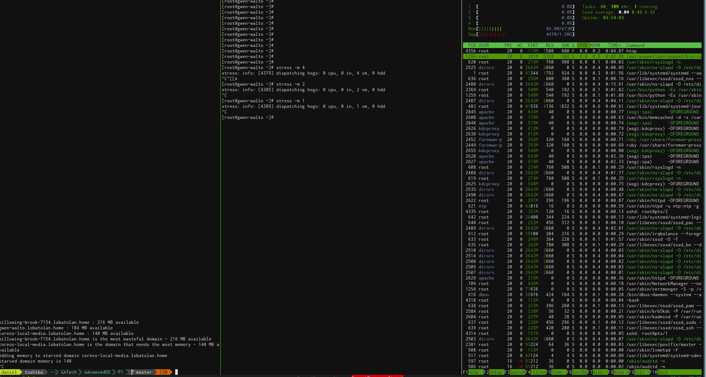

# kvmScheduling

vCPU scheduler &amp; memory coordinator for KVM through Libvirt

This is just a experiment to play with the libvirt APIs and
have a benchmarking tool for scheduling problems.

It consists of two projects:

  * A vCPU scheduler which tries to assign the best pCPU to each
  vCPU, based on fairness. It triggers only after a fixed usage
  percentage on one of the CPUs (defined in the source).

  * A memory scheduler based on fairness which keeps the unused memory
  on all active domain within certain boundaries (e.g between 100/300MB)

## Compile

Run `make` from the project's root to generate both programs.
You can also run `make` in each of the subfolders to only generate
one or the other program.

Find the binaries on `bin/memory_coordinator` and `bin/vcpu_scheduler`.

To compile this, make sure you have the packages `libvirt-dev` and `qemu-kvm`.

## Usage

### [Memory Coordinator](memory_coordinator/README.md)

### [vCPU Scheduler](vcpu_scheduler/README.md)

## TODOs

* Improve asymptotic complexity of scheduler. It spends so long gathering
statistics that it'll fail to work on a period smaller than 1 second
* Gather statistics using multiple threads way, with a barrier before
running the fairness algorithms
* Apply fairness only when a VM is above or below a certain standard deviation
of % unused / same thing for CPU % usage. The current threshold model is
quite naive and does not work well when all domains demand high resources.
* Write tests ¯\_(ツ)_/¯

## Community

If you are interested in maintaining this project, make some contributions
and I'll be glad to give you commit access here. This is not really meant
to be a substitute for the ballooning and scheduler algorithms in virtio
(shoutouts to you, kernel folks), it doesn't even take into account NUMA
and other stuff. Just a small simple project to play with these things.

## License

GPLv3, see [LICENSE](LICENSE)
